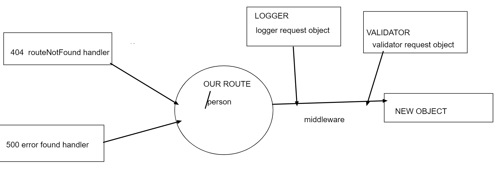

# basic-express-server

### lab- 02 
### Autor Nassir Abegaz

- <a href=https://basic-express-server1.herokuapp.com/ class="icon fa-twitter">go to heroku app </a>

- <a href=https://github.com/nassir1976/basic-express-server class="icon fa-twitter">go to gitHub </a>

<!-- - <a href=https://github.com/nassir1976/server-deployment-practice/pull/2 class="icon fa-twitter"> pull request </a> -->

### Phase 1 Requirements
- From a business requirements standpoint, we will be building a basic Express server using best practices, including server modularization, use of middleware, and tests.

- Person Route
- Method: GET
- Path: /person
- Expects a query string from the user with a “name” property
- When present, output JSON to the client with this shape: { name: "name provided" }
- Without a name in the query string, force a “500” error

### Testing Requirements
- Assert the following
- 404 on a bad route
- 404 on a bad method
- 500 if no name in the query string
- 200 if the name is in the query string
- given an name in the query string, the output object is correct

### test 

- unit Test: npm run test 
- lint Test : npm run lint  

### Documentation
- Compose a UML or Process/Data Flow Diagram for every application

